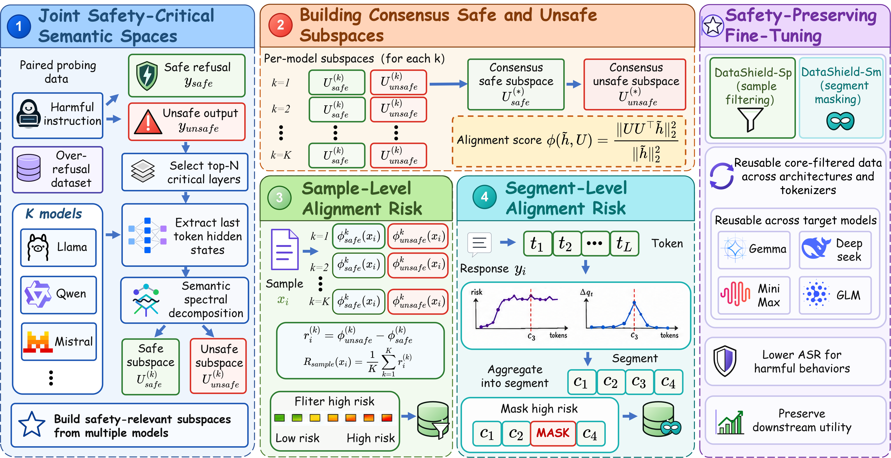

<div align="center">

<h1>🛡️ DataShield: Uncovering Risky Fine-Tuning Data Across LLMs Through Consensus Subspace Alignment</h1>

[](https://www.python.org/downloads/release/python-3100/)
[](LICENSE)
[](data/README.md)
[](https://github.com/ZJU-LLM-Safety/DataShield/stargazers)

<h2>⚡ Find risky data before fine-tuning. Transfer the signal across LLMs. ⚡</h2>

<p>
  <strong>DataShield</strong> is a generalizable and transferable pre-fine-tuning data safety framework that turns raw SFT corpora into consensus risk maps, then filters high-risk samples or masks high-risk segments before target-model adaptation.
</p>

<a id="framework-diagram"></a>



<br>

<table>
  <tr>
    <td align="center" width="25%">
      <br>
      <b>Risk Scoring</b><br>
      <sub>project examples into safety subspaces</sub>
    </td>
    <td align="center" width="25%">
      <br>
      <b>Consensus Fusion</b><br>
      <sub>aggregate evidence across references</sub>
    </td>
    <td align="center" width="25%">
      <br>
      <b>Transfer Scan</b><br>
      <sub>apply risk maps to target LLMs</sub>
    </td>
    <td align="center" width="25%">
      <br>
      <b>Loss Masking</b><br>
      <sub>suppress selected response segments</sub>
    </td>
  </tr>
</table>

<br>

[**Data**](data/README.md) · [**Framework**](#framework-diagram) · [**Quick Start**](#quick-start) · [**Pipeline**](#pipeline-reference)

</div>

## 🧭 Overview

DataShield is a pre-fine-tuning risky-data filtering framework. It protects downstream adaptation by finding safety-critical examples and segments before training, projecting them into safety-relevant subspaces built from multiple reference LLMs, aggregating model-specific risk estimates into a consensus risk map, and using that map to filter or mask high-risk response tokens during supervised fine-tuning.

The current release contains:

- **Risk scanning** with reference-model hidden states and safe/unsafe anchor subspaces.
- **Consensus ensembling** across multiple reference models.
- **Segment-level masking** for LoRA/full fine-tuning through Hugging Face `Trainer`.
- **Released data files** for the examples, with schemas documented in [data/README.md](data/README.md).

## ✨ Core Capabilities

| Capability | What it does |
| :--- | :--- |
| **Pre-fine-tuning risk filtering** | Finds high-risk training examples and segments before model adaptation, not after safety degradation appears. |
| **Multi-reference consensus** | Fuses safety signals from multiple LLM architectures instead of trusting a single model-specific score. |
| **Transferable safety subspaces** | Builds reusable safe/unsafe subspaces that can be applied before fine-tuning a different target model. |
| **Tokenizer-agnostic segment masking** | Scores response segments at token or word granularity and transfers masks across target tokenizers through character-level ranges. |
| **Utility-preserving mitigation** | Masks high-risk response segments or filters high-risk samples while preserving low-risk training signal. |

## 📁 Repository Structure

```text
DataShield/
├── subspace_projection.py    # Step 1: risk scanning and hidden-state projection
├── consensus_ensemble.py     # Step 2: multi-model safety index fusion
├── safe_finetune.py          # Step 3: masked LoRA/full fine-tuning
├── data/
│   ├── anchors/              # safe/unsafe anchors for subspace construction
│   └── train_data/           # training datasets to scan and fine-tune on
├── utils/                    # segment splitters, data loaders, training helpers
├── assets/                   # framework diagrams and visualizations
├── environment.yml           # conda environment config
└── requirements.txt          # pip dependency list
```

## ⚙️ Installation

```bash
git clone https://github.com/ZJU-LLM-Safety/DataShield.git
cd DataShield

conda env create -f environment.yml
conda activate datashield

cp .env.example .env

python -m spacy download en_core_web_sm
python -c "import nltk; nltk.download('punkt_tab')"
```

<a id="quick-start"></a>

## 🚀 Quick Start

DataShield runs in three stages. The typical setting uses multiple reference models for scanning, then ensembles their risk maps before fine-tuning a potentially different target model.

### 1. Risk Scanning

Project training responses into safe and unsafe reference subspaces. Run this step once per reference model. With `--reps_output_mode both`, each run writes both word-level and sample-level files.

```bash
# Reference model 1: Llama-3
python subspace_projection.py \
    --model_path meta-llama/Meta-Llama-3-8B-Instruct \
    --train_file data/train_data/dolly_no_safety.json \
    --unsafe_anchor_file data/anchors/pure-bad-100.jsonl \
    --safe_anchor_file data/anchors/pure-bad-100-anchor1.jsonl \
    --reps_output_mode both \
    --span_granularity word \
    --rep_layers "13,16,19" \
    --output_json results/llama3_dolly_spans.json

# Reference model 2: Gemma-2
python subspace_projection.py \
    --model_path google/gemma-2-9b-it \
    --train_file data/train_data/dolly_no_safety.json \
    --unsafe_anchor_file data/anchors/pure-bad-100.jsonl \
    --safe_anchor_file data/anchors/pure-bad-100-anchor1.jsonl \
    --reps_output_mode both \
    --span_granularity word \
    --rep_layers "29,31,22" \
    --output_json results/gemma2_dolly_spans.json
```

Expected outputs:

- `results/llama3_dolly_spans_word_level.json`
- `results/llama3_dolly_spans_sample_level.json`
- `results/llama3_dolly_spans_preview.json`
- `results/gemma2_dolly_spans_word_level.json`
- `results/gemma2_dolly_spans_sample_level.json`
- `results/gemma2_dolly_spans_preview.json`

### 2. Consensus Ensemble

Fuse risk maps from multiple reference models. Use `--filter_ratio` or `--top_k` to keep only high-risk segments for masking.

```bash
python consensus_ensemble.py \
    --inputs results/llama3_dolly_spans_word_level.json results/gemma2_dolly_spans_word_level.json \
    --output results/consensus_fusion.json \
    --agg mean \
    --filter_ratio 0.05
```

To use more reference models, repeat Stage 1 with additional models such as Qwen, then append their `*_word_level.json` files to `--inputs`.

### 3. Safety-Preserving Fine-Tuning

Fine-tune the target model with the consensus mask. Word/token-level masks disable loss on selected response segments.

```bash
python safe_finetune.py \
    --base_model_path Qwen/Qwen2.5-7B-Instruct \
    --data_path data/train_data/dolly_no_safety.json \
    --output_path results/finetuned_model \
    --finetune_mode lora \
    --safety_mask_path results/consensus_fusion.json
```

<a id="pipeline-reference"></a>

## 🧩 Pipeline Reference

| Stage | Script | Main Input | Main Output | Notes |
| :--- | :--- | :--- | :--- | :--- |
| Projection | `subspace_projection.py` | training data + anchors | word/sample risk scores | Requires a reference LLM. |
| Ensemble | `consensus_ensemble.py` | multiple risk-score files | consensus mask | Use `--filter_ratio` or `--top_k` before training. |
| Fine-tuning | `safe_finetune.py` | training data + mask | adapter/model artifacts | Supports LoRA and full fine-tuning. |

## 📦 Data

The repository includes released data under `data/`:

| Path | Format | Size |
| :--- | :--- | ---: |
| `data/anchors/pure-bad-100.jsonl` | chat-message JSONL | 99 rows |
| `data/anchors/pure-bad-100-anchor1.jsonl` | chat-message JSONL | 99 rows |
| `data/train_data/alpaca-gpt4_no_safety.json` | instruction-tuning JSON | 45,774 rows |
| `data/train_data/dolly_no_safety.json` | instruction-tuning JSON | 14,624 rows |

See [data/README.md](data/README.md) for schemas, intended use, and safety notes.

## 🧠 Supported Reference Models

DataShield can use any compatible causal LM with hidden-state access. The released examples use:

- `meta-llama/Meta-Llama-3-8B-Instruct` with default top-3 layers `13,16,19`
- `Qwen/Qwen2.5-7B-Instruct` with default top-3 layers `18,20,23`
- `google/gemma-2-9b-it` with default top-3 layers `29,31,22`

## 🛡️ Safety And Intended Use

This repository is intended for research on fine-tuning safety, reproducibility, and controlled safety evaluation. The data may contain safety-sensitive examples. Do not use the data or models produced from it to build or optimize systems for harmful behavior. If you redistribute derived datasets or checkpoints, preserve the safety context and usage restrictions. For sensitive reports, see [SECURITY.md](SECURITY.md).

## 🙏 Acknowledgements

We thank the authors of [LARF](https://github.com/LLLeoLi/LARF) and [Safety-Layers](https://github.com/listen0425/Safety-Layers) for open-sourcing related research code and resources that support the broader study of fine-tuning safety.

## 📄 License

This project is released under the MIT License. See [LICENSE](LICENSE).
